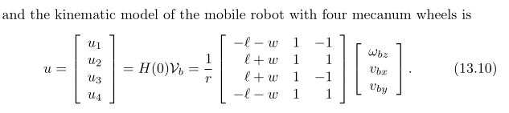
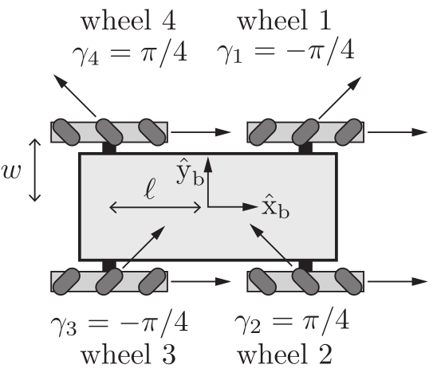

# Inverse Kinematics 
The model used for the individual motor speeds are referenced from Modern Robotics by Kevin M. Lynch and Frank C. Park, page 519, chapter 13.2: Omnidirectional Wheeled Mobile Robots. The previous pages go over its derivation. 

The length and the width of the robot should be measured demonstrated by this diagram, which is located in the same page and chapter: 

In summary, this kinematic model answers this important question: "How fast must the motors rotate given a desired chassis velocity?" This is answered by relating the entirety of the robot's velocity $[w_{bz}, v_{bx}, v_{by}]$, otherwise known as the chassis' planar twist, to individual motor speeds, which are labeled $u_1, u_2, u_3,$ and $u_4$.  
